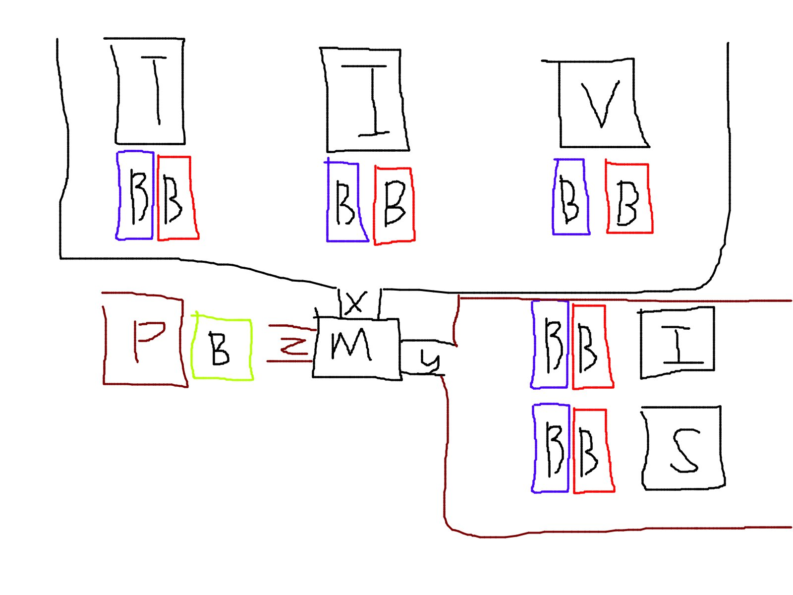
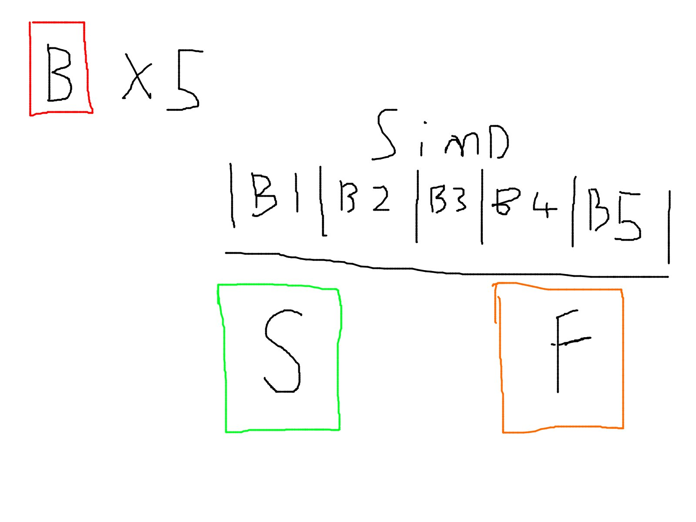
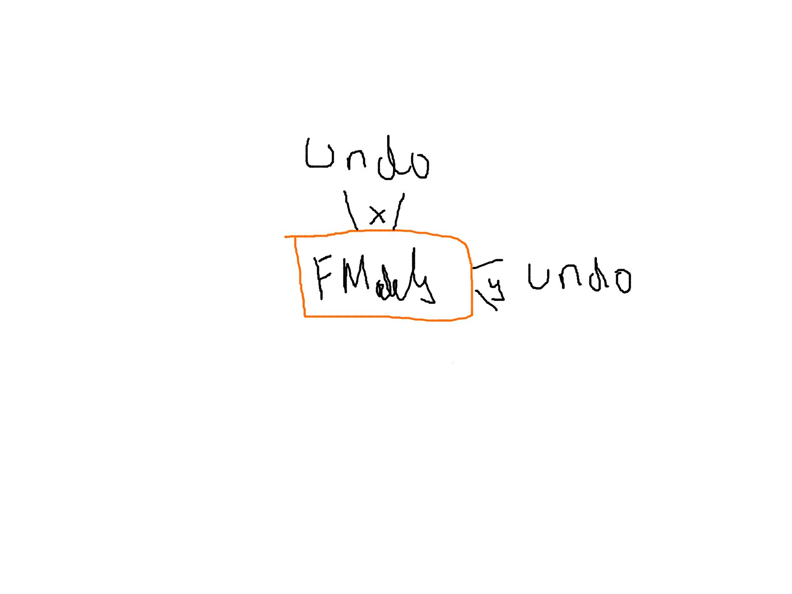

# Model Loading Outline

**Note:**
This explanation uses the general term 'model', as currently I am just working with a basic textured cube
which uses only one primitive as a proof of concept. However the design being laid out is not limited to just
models: systems can easily be build on top of which do not pass an array of entire models, but instead model
primitives / meshes, and these go through the system in a way which is more gpu efficient.

**Note:**
Images show individual threads 'X', 'Y', and 'Z' interacting with their shown domains. These threads can be split
further into, for example X1, X2, X3 for texture, index, and vertex allocations, Y1 and Y2 for sampler and image view,
as the allocators 'T', 'I', and 'V' in the X domain, and 'S' and 'I' in the Y domain can exist on separate threads
themselves. Z can be split arbitrarily, as it does not rely on any central controller.

## 1.



Models are submitted as an array along with their draw info (pipeline configs and renderpass type). The type
of the model is switched on, calling its corresponding 'setup' function:

    ```
    prepare_draw_models(..) {
        for(model : models)
            switch(model.type) {
            case CAR:
                setup_draw_car(..)
            ..
            }
    }
    ```

A car's setup function may look like:

    ```
    struct Car {
        Glass glass;
        Body  body;
        Wheel wheel;
    };
    setup_draw_car(..) {
        create_pipelines(glass);
        create_pipelines(body);
        ...

        allocate_textures(body);
        allocate_vertices(body);
        ...
    }
    allocate_textures(..) {
        upload_texture(..);
        get_texture_descriptors(..);
    }
    ```

Where each of these functions writes allocation keys to the blue buffers labelled 'B' in the above image,
corresponding to thread 'X' which are read by the allocators. Similarly, sampler and image view keys are written to
the blue buffers corresponding to thread 'Y'. Return values are written by the allocators to the red buffers. All
allocations, image views, samplers etc are submitted.

## 2.



Results are read back from the return buffers (asynchronously). At the current stage of the engine, there can be
five results: texture, index and vertex allocations, and samplers and image views. If all of the pieces required
by a model were acquired successfully, these models pass into a 'success' array, where they can move on to have their
queues submitted to allocators, and later drawn.

## 3.



Models which only partially acquired their required resources must be reset: most obviously, if an allocation late in
the array made it into an allocation queue, but other earlier allocations acquired image views but did not enter
the queue, then it is possible that these resources can lock up, as the late allocation is uploaded, but never drawn
as it cannot acquire other resources that it needs, as they are taken by earlier array elements, so it takes up
space that would be better available elsewhere.

As such, resources which were successfully acquired, but which only made up a partial set will be resubmitted to
tex/index/vertex/sampler/image view allocators relinquish their queue spot/resource. This is unfortunate, as this
is blocking allocator queue submissions, but I cannot see another way. It is not expensive to remove from queues so it
is not a huge deal, but certainly an area to improve.
